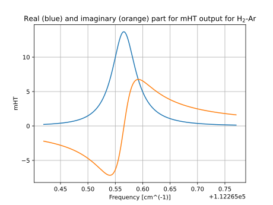
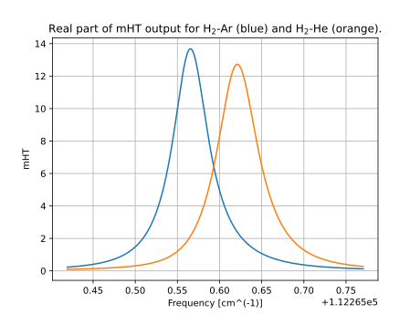

# spectral-line-shapes

The spectral-line-shapes repository hosts the implementations of the modified Hartman-Tran (`mHT`) spectral line-shape profile. The mHT is a variation of the Hartman-Tran profile (HT or HTP, introduced in 10.1016/j.jqsrt.2013.06.015). The article describing the mHT spectral lineshape function is currently under preparation. The mHT is a function with complex output. Its real and imaginary parts are the absorbtion and dispersion profiles, respectively.

The spectral-line-shapes repository features the implementations of the complex problability function (cpf), which are used to calculate the mHT. Though optimized specifically to work with the mHT, the cpf functions can also be used separately. The repository features two cpf functions: `cpf_accurate` (maintaining high accuracy, based on highly-modified 64-term Weideman algorithm jstor.org/stable/2158232), and `cpf_fast` (faster but less accurate, utilizing Humlicek's aproach in its first subregion, 10.1016/0022-4073(82)90078-4, and 24-term Weideman approach elsewhere jstor.org/stable/2158232). The detailed description of the modifications of the cpf functions will be summarized in the upcoming article.

At the moment, the python, fortran and matlab implementations have been developed, while the mathematica and labview implementations are under preparation.

## Installation

Clone the repository using:

```
git clone https://github.com/nikodem-stolarczyk/spectral-line-shapes/
```
This will clone all the implementations.

## Dependencies

Depending on the implementation, the following program versions are required

### python
- Python 3.X
- numpy and matplotlib (used solely in example_plots.py, the mHT and cpf functions do not need these libraries)
### Fortran
- **Fortran Standard**: The code is written in Fortran 90 (compatible with later standards). It's important to use a compiler that supports at least Fortran 90.
- **Recommended Compilers**: 
  - [GNU Fortran Compiler (gfortran)](https://gcc.gnu.org/wiki/GFortran)
  - [Intel Fortran Compiler (ifort)](https://software.intel.com/content/www/us/en/develop/tools/oneapi/components/fortran-compiler.html)
- **Build System**:
  - [Make](https://www.gnu.org/software/make/)
### matlab
- minimum MATLAB version required still to be determined, tested in R2024a and R2022b

### mathematica

### labview

## Usage

### python
The `example_absorption.py` and `example_dispersion.py` files present the basic syntax and usage of the mHT function to calculate absorption and dispersion of a spectral line. The `example_mHT_optional_parameters.py` presents the syntax with the optional parameters.
The `example_plots.py` file generates two plots:
- the absorption and dispersion profiles of the Ar-perturbed 3-0 S(1) line in H<sub>2</sub> (see [Stolarczyk et al.](https://doi.org/10.1063/5.0139229))



- the comparison the absorption profiles of the Ar- and He-perturbed 3-0 S(1) line H<sub>2</sub> (see [Stolarczyk et al.](https://doi.org/10.1063/5.0139229) and [Slowinski et al.](https://doi.org/10.1103/PhysRevA.101.052705)).



The `example_cpf` file presents the syntax for the `cpf_accurate` and `cpf_fast` functions.

### Fortran
The following usage examples demonstrate the application of the Fortran implementation for purposes:

#### Example: Absorption Profile

**File:** `example_absorption.f90`

This example demonstrates how to calculate the absorption profile at a single frequency for the Ar-perturbed 3-0 S(1) line in H<sub>2</sub>.

#### Example: Dispersion Profile

**File:** `example_dispersion.f90`

This example demonstrates how to calculate the absorption profile at a single frequency for the Ar-perturbed 3-0 S(1) line in H<sub>2</sub>.

#### Example: Complex Probability Function (CPF)

**File:** `example_cpf.f90`

This example provides two function calls for `cpf_accurate` and `cpf_fast` for trivial arguments (1, 1).

#### Example: mHT with Optional Parameters

**File:** `example_mHT_optional_parameters.f90`

This example provides the absorption and dispersion profile at a single frequency for the Ar-perturbed 3-0 S(1) line in H<sub>2</sub> with additional parameters passed to the `profile` function: the real and imaginary parts of the line-mixing coefficient, and the perturber-to-absorber mass ratio.

#### Example: Generating Profiles for Plotting

**File:** `example_profiles.f90`

Since Fortran lacks direct plotting capabilities, this example generates and exports data for spectral profiles of the Ar- and He-perturbed 3-0 S(1) lines in H<sub>2</sub> that can be plotted using external tools such as Python's Matplotlib or GNUplot. The output files (`mHT_profile_H2Ar.txt` and `mHT_profile_H2He.txt`) involve three columns, corresponding to the frequency, real (absorption) and imaginary (dispersion) parts of the mHT profile.

#### Compilation Instructions

Each example can be compiled individually or all together using the provided Makefile. Below are the instructions for both approaches:

##### Compiling Individual Examples

To compile a specific example, you can use the `make` command followed by the target name. Each target corresponds to an example as described above. For example, to compile the absorption profile example, you would use the following command:

```bash
make absorption
```

Here are the commands for compiling other specific examples:
- Dispersion Profile
```bash
make dispersion
```
- Complex Probability Function (CPF)
```bash
make cpf
```
- mHT with Optional Parameters
```bash
make optional_parameters
```
- Generating Profiles for Plotting
```bash
make profiles
```

This command will compile the necessary source files and link them to produce an executable named `example_absorption.x`.

##### Compiling All Examples
If you wish to compile all the examples at once, you can use the `make all` command.
This command will sequentially compile all the usage examples and create an executable for each one. Executables will be named according to their respective examples, as specified in the Makefile.

### matlab
The `example_*.m` files contains part that adds `mHT Package` catalog to the PATH. This allows the mHT functions be used in any path withouth need of moving the functions/package. The `example_absorption.m` and `example_dispersion.m` files present the basic syntax and usage of the mHT function to calculate absorption and dispersion of a spectral line. The `example_mHT_optional_parameters.m` presents the syntax with the optional parameters and how to add/call some or all of them at once. The `example_plots.m` file generates same plots as in `python` usage example and for the sake of the readability are not presented here. The `example_cpf` file presents the syntax for the `cpf_accurate` and `cpf_fast` functions.

### mathematica

### labview
## Data Format

### mHT 

The `mHT` function requires the following arguments:
- `nu0` - Unperturbed line position in cm-1.
- `GamD` - Doppler broadening in cm-1
- `Gam0` - Speed-averaged line-width in cm-1.
- `Gam2` - Speed dependence of the line-width in cm-1.
- `Shift0` - Speed-averaged line-shift in cm-1.
- `Shift2` - Speed dependence of the line-shift in cm-1.
- `NuOptRe` - Real part of the Dicke parameter in cm-1.
- `NuOptIm` - Imaginary part of the Dicke parameter in cm-1.
- `nu` - Current WaveNumber of the Computation in cm-1.

The following arguments are optional:
- `Ylm` - Real part of the 1st order (Rosenkranz) line mixing coefficients, dimensionless.
- `Xlm` - Imaginary part of the 1st order (Rosenkranz) line mixing coefficients, dimensionless.
- `alpha` - Mass ratio in the molecule for calculating beta-correction, applicable up to alpha=5, dimensionless.

### cpf

Both `cpf_accurate` and `cpf_fast` functions require two arguments, `x` and `y`. The meaning of `x` and `y` input values varies, depending on the application of the cpf. In the spectral line-shape context, `y` is the ratio between Lorentian and Doppler broadening (y=sqrt(log(2))*Gam0/GamD), and `x` is the normalized detuning from the line center (x=sqrt(log(2))*(nu-nu0)/GamD). The `x` and `y` values are dimensionless.    

## Contributing

Contributions are welcome. Please fork the repository and submit pull requests with your enhancements.
